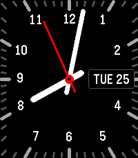

# Chazybazy's Watchface 

A Pebble watchapp/watchface written in C using the Pebble SDK.



## Building & running

### With the local SDK

```sh
pebble build                          # build for all targetPlatforms
pebble install --emulator emery       # install on the emery emulator
pebble install --phone <ip>           # install to a paired phone
```

Download from the Pebble App Store now: [Chazybazy's Watchface](https://apps.repebble.com/chazybazy-s-watchface_14d2b30fb13d46068fff58d7)

### Installing over the CloudPebble connection

The CloudPebble connection is a transport to your phone, so the tool can push a
locally built `.pbw` to the watch without a cable or a LAN IP. Enable the
developer connection in the Pebble mobile app first, then:

```sh
pebble login                          # authenticate the tool with your account
pebble build
pebble install --cloudpebble          # push this build to the paired watch
```

## Publishing

`pebble publish` uploads a release to the Pebble appstore
(`appstore-api.repebble.com`). It needs `pebble login` first, and it publishes
whatever is currently built, so build before you publish:

```sh
pebble build
pebble publish --release-notes "First release"
```

Before uploading, the tool captures rollover GIFs on the emulator for every
supported platform (this is where `screenshots/` comes from). `--all-platforms`
adds static screenshots as well, and `--no-gif-all-platforms` skips the capture.


## Target platforms

`targetPlatforms` in `package.json` controls which watches you build for. The
modern Pebble hardware is **emery** (Pebble Time 2), **gabbro** (Pebble Round
2), and **flint** (Pebble 2 Duo); the original Pebble platforms are aplite,
basalt, chalk and diorite. This project targets **emery** only — add the others
back to `targetPlatforms` if you want them.

## Project layout

```
src/c/           C source for the watchapp
src/pkjs/        PebbleKit JS (phone-side) source, if any
worker_src/c/    Background worker source, if any
resources/       Images, fonts, and other bundled resources
package.json     Project metadata (UUID, platforms, resources, message keys)
wscript          Build rules — usually no need to edit
```

This project is configured as a watchface (`pebble.watchapp.watchface` is
`true` in `package.json`).

## Documentation

Full SDK docs, tutorials, and API reference: <https://developer.repebble.com>
